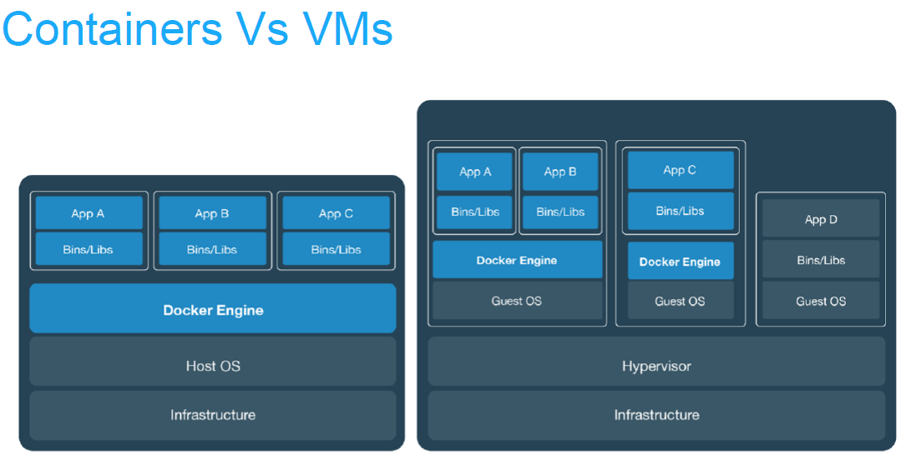
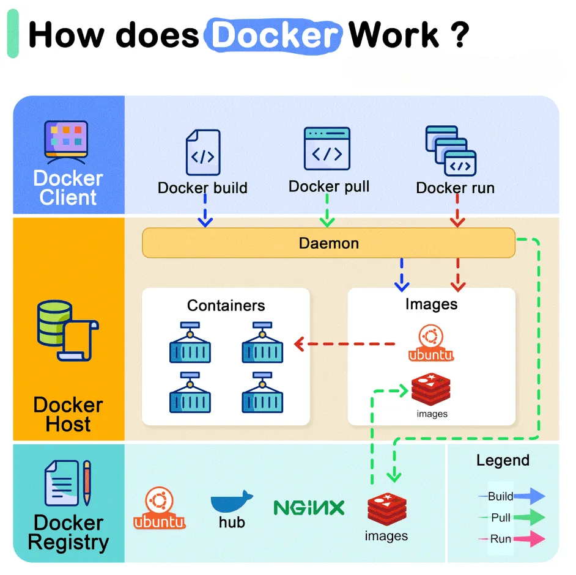
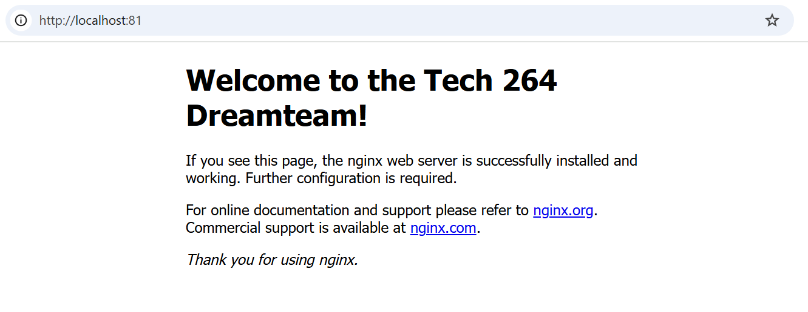

# Docker
- [Docker](#docker)
  - [Differences Between Virtualisation and Containerisation](#differences-between-virtualisation-and-containerisation)
    - [Virtualisation](#virtualisation)
    - [Containerisation](#containerisation)
    - [Summary of Differences](#summary-of-differences)
  - [What Is Usually Included in a Container vs. Virtual Machine?](#what-is-usually-included-in-a-container-vs-virtual-machine)
    - [Container](#container)
    - [Virtual Machine](#virtual-machine)
  - [Benefits](#benefits)
    - [Virtual Machine Over Traditional Architecture](#virtual-machine-over-traditional-architecture)
    - [Containerisation Benefits](#containerisation-benefits)
  - [Microservices](#microservices)
    - [What Are They?](#what-are-they)
    - [How Are They Made Possible?](#how-are-they-made-possible)
    - [Benefits](#benefits-1)
  - [Docker](#docker-1)
    - [What Is It?](#what-is-it)
    - [Alternatives](#alternatives)
    - [How It Works (Docker Architecture/API)](#how-it-works-docker-architectureapi)
    - [Success Story Using Docker](#success-story-using-docker)
- [How Docker works?](#how-docker-works)
- [Using Docker in GitBash](#using-docker-in-gitbash)
  - [Docker Work Flow - Nginx Container](#docker-work-flow---nginx-container)
    - [Run commands within a container](#run-commands-within-a-container)
- [Task: Push host-custom-static-webpage container image to Docker Hub](#task-push-host-custom-static-webpage-container-image-to-docker-hub)
- [Task: Automate docker image creation using a Dockerfile](#task-automate-docker-image-creation-using-a-dockerfile)
  - [Prerequisites](#prerequisites)
  - [1. Build the Custom Docker Image](#1-build-the-custom-docker-image)
  - [2. Run the Container](#2-run-the-container)
  - [3. Test the Container](#3-test-the-container)
  - [4. Log in to Docker Hub](#4-log-in-to-docker-hub)
  - [5. Tag the Image for Docker Hub](#5-tag-the-image-for-docker-hub)
  - [6. Push the Custom Image to Docker Hub](#6-push-the-custom-image-to-docker-hub)
  - [7. Share the Docker Run Command](#7-share-the-docker-run-command)
- [Task: Run Sparta test app in a container](#task-run-sparta-test-app-in-a-container)
  - [Prerequisites](#prerequisites-1)
  - [Step 1: Build the Docker Image](#step-1-build-the-docker-image)
  - [Step 2: Run the Docker Container Locally](#step-2-run-the-docker-container-locally)
  - [Step 3: Log In to Docker Hub](#step-3-log-in-to-docker-hub)
  - [Step 4: Push the Image to Docker Hub](#step-4-push-the-image-to-docker-hub)
  - [Step 5: Share the Image](#step-5-share-the-image)
  - [Notes](#notes)
- [Research on Docker Compose](#research-on-docker-compose)
  - [What is Docker Compose and Why Use It?](#what-is-docker-compose-and-why-use-it)
    - [Why Use Docker Compose?](#why-use-docker-compose)
  - [How to Use Docker Compose](#how-to-use-docker-compose)
    - [Basic Structure of `docker-compose.yml`](#basic-structure-of-docker-composeyml)
  - [What Do You Need to Install for Docker Compose to Work?](#what-do-you-need-to-install-for-docker-compose-to-work)
    - [Installation Steps](#installation-steps)
  - [Storing Your Docker Compose File](#storing-your-docker-compose-file)
  - [Docker Compose Commands](#docker-compose-commands)
    - [Manage Your Application](#manage-your-application)
    - [Start the Application (Without Detached Mode)](#start-the-application-without-detached-mode)
    - [Start the Application (In Detached Mode)](#start-the-application-in-detached-mode)
    - [Difference Between Running With or Without Detached Mode](#difference-between-running-with-or-without-detached-mode)
    - [Stop the Application](#stop-the-application)
    - [Run Your Application in Detached Mode](#run-your-application-in-detached-mode)
    - [Check Services Running with Docker Compose](#check-services-running-with-docker-compose)
    - [View Logs in Real-Time](#view-logs-in-real-time)
    - [View Docker Compose Images](#view-docker-compose-images)
- [Using Docker Compose to set up the App and DB containers](#using-docker-compose-to-set-up-the-app-and-db-containers)
  - [Manually seeding the database](#manually-seeding-the-database)
  - [Automatically seeding the database](#automatically-seeding-the-database)
  - [Blockers](#blockers)

## Differences Between Virtualisation and Containerisation

### Virtualisation
- **Definition**: Virtualisation is the process of creating a virtual version of a physical computing resource, such as a virtual machine (VM).
- **How it Works**: It uses a hypervisor to emulate hardware, allowing multiple operating systems to run on a single physical machine.
- **Resource Isolation**: Each VM has its own OS, drivers, and libraries, which results in more overhead compared to containers.
- **Use Cases**: Often used for running multiple applications requiring different operating systems on the same hardware.

### Containerisation
- **Definition**: Containerisation encapsulates an application and its dependencies into a container, using the host system’s OS kernel.
- **How it Works**: Containers share the host operating system but isolate application processes using namespaces and control groups (cgroups).
- **Resource Isolation**: More lightweight compared to VMs, as they do not require separate OS instances.
- **Use Cases**: Ideal for microservices architecture and cloud-native applications.

### Summary of Differences
| Aspect              | Virtualisation                         | Containerisation                    |
|---------------------|----------------------------------------|-------------------------------------|
| Isolation Level     | Full OS isolation                      | Process-level isolation             |
| Resource Usage      | High overhead                          | Lightweight                         |
| Startup Time        | Minutes                                | Seconds                             |
| Portability         | Limited                                | Highly portable                     |
| Use Cases           | Legacy applications, multiple OS       | Microservices, cloud-native apps    |

## What Is Usually Included in a Container vs. Virtual Machine?

### Container
- **Application Code**: The main application being containerized.
- **Dependencies**: Libraries, environment variables, and other required software.
- **Container Runtime**: Tools that allow containers to run, like Docker Engine.
- **Lightweight OS**: Shares the host OS kernel, only necessary binaries are included.

### Virtual Machine
- **Guest Operating System**: A full OS instance, including kernel and drivers.
- **Application Code**: The software running on the virtualized OS.
- **Hypervisor**: Software to manage VMs, like VMware or Hyper-V.
- **Virtualised Hardware**: Simulated network interfaces, disks, and memory.

## Benefits

### Virtual Machine Over Traditional Architecture
1. **Isolation**: Complete OS isolation ensures robust security between VMs.
2. **Resource Utilisation**: Can run multiple VMs on a single physical machine, maximizing hardware usage.
3. **Legacy Support**: Useful for running legacy applications on modern infrastructure.

### Containerisation Benefits
1. **Efficiency**: Uses fewer resources than VMs and starts up faster.
2. **Portability**: Easily deployed across different environments.
3. **Microservices Compatibility**: Perfect for microservices architecture.

---

## Microservices

### What Are They?
- **Definition**: Microservices are an architectural style that structures an application as a collection of small, autonomous services.
- **Characteristics**: Each service is independent, responsible for a specific function, and can be developed and deployed separately.

### How Are They Made Possible?
- **API Communication**: Microservices communicate over HTTP/REST or messaging queues.
- **Containerisation** (Top priority): Tools like Docker package and deploy services easily.
- **Service Discovery**: Tools like Consul or Eureka for identifying service locations dynamically.
- **DevOps and CI/CD**: Support the management and deployment of microservices. 

### Benefits
1. **Scalability**: Each service can be scaled independently.
2. **Resilience**: Failure in one service does not crash the entire application.
3. **Faster Deployment**: Independent development and deployment improve agility.

---

## Docker



https://dockerlabs.collabnix.com/beginners/difference-docker-vm.html

### What Is It?
- **Definition**: Docker is a platform for developing, shipping, and running applications in containers.
- **Purpose**: It allows developers to package applications with all dependencies into a single container.

### Alternatives
- **Kubernetes**: A powerful container orchestration tool.
- **Podman**: A daemonless container engine.
- **LXC/LXD**: Linux containers for system-level virtualization.
- **CRI-O**: Lightweight container runtime for Kubernetes.

### How It Works (Docker Architecture/API)
1. **Docker Engine**: The runtime for running containers.
2. **Docker Images**: Templates used to create containers.
3. **Docker Containers**: The running instances of Docker images.
4. **Docker CLI**: Command-line interface for interacting with Docker.
5. **Docker API**: REST API for automating Docker commands and managing containers.

### Success Story Using Docker
- **Spotify**: Utilized Docker to improve development and testing environments, accelerating software delivery. Docker allowed the team to ensure a consistent setup across development, staging, and production environments.

# How Docker works?


* *API* is used between the **daemon** (server) and the **client**. 
* **Registry** includes **Docker Hub** which stores the container images. 
* The **Client** and the **DOCKER_HOST** are in the local machine. 

# Using Docker in GitBash
 
Commands to know:
- `docker --help`: displays commands you can use.
- `docker images`: useful for checking what images are available locally, so you can manage, update, or remove them as needed.
- `docker run hello-world`: A message that tells you that your docker is set up and working correctly.
- `docker ps`: Will display any containers running.
 
## Docker Work Flow - Nginx Container
- `docker run -d -p 80:80 nginx`: A command that runs a container from the nginx image in detached mode and maps port 80 of the host machine to port 80 in the container. Thisd will be viewable on a webpage for the IP `127.0.0.1` or simply input `localhost`.

  - `-d`: Detached mode. Makes it run in the background.
  - `-p host_port:container_port`: Maps port on the host machine to the port in the container. Allows external traffic to the host's port to be routed to the container's port.  
- `docker stop <container name>`: Used to stop a container.
- `docker ps --all (or -a)`: Shows all containers, including ones that are not currently active.
- `docker
- `docker start <container name>`: Start up the chosen container.
- `docker remove --force (or -f) <container name>`: Force removes the container, even if active. To do it without forcing, you must first use `docker stop`.

- `alis tf="terraform"`: Sets up an alias for the `terraform` command. Can be used to reduce input.
 
### Run commands within a container
- `docker exec -it <container ID> sh`: Used to execute commands within a specified container.
  - `-it`: Combines -i (interactive) and -t (allocates a pseudo-TTY) options to allow interaction with the container's terminal.
  - `sh`: The shell command that opens a shell session inside the container.
 
*Note! This will give you the following error: `the input device is not a TTY.  If you are using mintty, try prefixing the command with 'winpty'`. Fear not! This is normal. To fix this, we can use the `alias` command we saw ea:*
 
- `alias docker="winpty docker"`: This will replace `docker` with `winpty docker`, adding that preface we required from the error.
 
Running that `exec` command will now work, as we've solved he prexifxing issue AND reduced manual input required in the future.
 
The `#` means that we are now inside the container.
 
- `uname -a`: We can use this command to see the information regarding the container.
- `apt-get update -y`: Updates the local package index to ensure the package lists are current.
- `-y`: Flag for "yes" to skip manual inputs.
- `apt-get upgrade -y`: Upgrades all installed packages to their latest versions based on the current package index
- `apt-get install sudo`: Install sudo onto our container (we can do)

# Task: Push host-custom-static-webpage container image to Docker Hub


1. Commit the Running Container to an Image: `docker commit <image-id> <YOUR_DOCKER_HUB_USERNAME>/<IMAGE_NAME>`
2. Authenticate yourself: `docker login`.
3. Push the image: `docker push <YOUR_DOCKER_HUB_USERNAME>/<IMAGE_NAME>`
4. Verify the image on **Docker Hub**. 
5. Delete the Local Image. Remove the image from your local Docker environment to test pulling it from Docker Hub: `docker rmi <YOUR_DOCKER_HUB_USERNAME>/<IMAGE_NAME>`
6. Run your image: `docker run -d -p 81:80 <YOUR_DOCKER_HUB_USERNAME>/<IMAGE_NAME>`
7.  You can see that on port 81 your localhost is displaying that image. 

# Task: Automate docker image creation using a Dockerfile
## Prerequisites
* You need a `index.html` and a `Dockerfile`. 
* `Dockerfile`:
```docker
# Use the official Nginx base image
FROM nginx:latest

# Copy the custom index.html to the default Nginx HTML location
COPY index.html /usr/share/nginx/html/

# Expose port 80
EXPOSE 80
```
## 1. Build the Custom Docker Image
Use the `docker build` command to build your image. Make sure you are in the directory where your `Dockerfile` and `index.html` are located.

```bash
docker build -t tech2xx-nginx-auto:v1 .
```
- **-t**: This flag is used to tag the image. Here, `tech2xx-nginx-auto` is the name of your image, and `:v1` is the version tag.
- **.**: The dot represents the current directory (where the `Dockerfile` is located).

## 2. Run the Container
Run a container from your custom image:

```bash
docker run -d -p 80:80 tech2xx-nginx-auto:v1
```
- **-d**: Runs the container in detached mode (in the background).
- **-p 80:80**: Maps port 80 on the host machine to port 80 in the container.
- `tech2xx-nginx-auto:v1`: The name and tag of your image.

## 3. Test the Container
- Open a web browser and visit `http://localhost` (or `http://<your-docker-host-IP>` if not running on your local machine).
- You should see your custom Nginx page with the content from `index.html`.

## 4. Log in to Docker Hub
If you haven't logged in already, use the following command to log in to your Docker Hub account:

```bash
docker login
```
You will be prompted to enter your Docker Hub username and password. Or if already logged in it will just say succeeded. 

## 5. Tag the Image for Docker Hub
Tag your image with your Docker Hub username and the desired repository name:

```bash
docker tag tech2xx-nginx-auto:v1 <YOUR_DOCKER_HUB_USERNAME>/tech2xx-nginx-auto:v1
```
- Replace `<YOUR_DOCKER_HUB_USERNAME>` with your Docker Hub username.

## 6. Push the Custom Image to Docker Hub
Use the `docker push` command to upload your image to Docker Hub:

```bash
docker push <YOUR_DOCKER_HUB_USERNAME>/tech2xx-nginx-auto:v1
```
- This will push your custom image to your Docker Hub account.

## 7. Share the Docker Run Command
Once the image is pushed, you can share the following command so others can run your container:

```bash
docker run -d -p 80:80 <YOUR_DOCKER_HUB_USERNAME>/tech2xx-nginx-auto:v1
```
- Make sure to replace `<YOUR_DOCKER_HUB_USERNAME>` with your actual Docker Hub username.

---

Your image is now hosted on Docker Hub and can be pulled and run by anyone using the provided `docker run` command!

# Task: Run Sparta test app in a container

## Prerequisites
* Need a file 
* Dockerfile:
```
# Step 1: Specify the base image
FROM node:20-alpine3.20

# Step 2: Add a label for metadata (e.g., author)
LABEL maintainer="priyansappal@mail.com"

# Step 3: Set the default working directory in the container
WORKDIR /usr/src/app

# Step 4: Copy the app folder from the host to the working directory in the container
COPY app /usr/src/

# Step 5: Copy the package.json and package-lock.json files
COPY package*.json ./

# Step 6: Install dependencies
RUN npm install

# Step 7: Expose the port that the app will run on
EXPOSE 3000

# Step 8: Define the command to run the app
CMD npm start app.js

```

## Step 1: Build the Docker Image
Navigate to your project directory and run:

```bash
docker build -t yourusername/sparta-app:v1 .
```
- **-t**: Tags the image. Replace `yourusername` with your Docker Hub username, and `20` is the version tag.
- **.**: Specifies the current directory as the build context.

---

## Step 2: Run the Docker Container Locally
To test your image, run:

```bash
docker run -d -p 3000:3000 yourusername/sparta-app:v1
```
- **-d**: Runs the container in detached mode.
- **-p 3000:3000**: Maps port 3000 from the container to port 3000 on your host.
- Visit `http://localhost:3000` to ensure the app is working.

---

## Step 3: Log In to Docker Hub
Log in to your Docker Hub account:

```bash
docker login
```
- Enter your Docker Hub username and password when prompted.

---

## Step 4: Push the Image to Docker Hub
Tag the image for your Docker Hub account (if not already tagged):

```bash
docker tag yourusername/sparta-app:v1 yourusername/sparta-app:v1
```

Then, push the image:

```bash
docker push yourusername/sparta-app:v1
```
- **yourusername**: Replace this with your Docker Hub username.
- **node-app:20**: Your image name and version tag.

---

## Step 5: Share the Image
You can share your image with others using the following command:

```bash
docker run -d -p 3000:3000 yourusername/sparta-app:v1
```
- They can use this command to pull the image from Docker Hub and run it.

---

## Notes
- Make sure you've created a Docker Hub account if you don't have one yet.
- If your image is large, the push process might take a few minutes.
- You can view your pushed images on your [Docker Hub account](https://hub.docker.com).

---

Your Node.js app is now available on Docker Hub and ready to be used by others!

# Research on Docker Compose

## What is Docker Compose and Why Use It?
Docker Compose is a tool used to define and manage multi-container Docker applications. It simplifies the process of orchestrating multiple containers that are dependent on each other, like a web server container, a database container, etc. 

### Why Use Docker Compose?
- **Simplified Management**: Define all your application’s containers, networks, and volumes in a single `docker-compose.yml` file.
- **Ease of Use**: You can start and stop all services with simple commands.
- **Reusability**: Easily share the entire configuration and setup with others, ensuring consistency across environments.
- **Dependency Handling**: Docker Compose takes care of creating and starting containers in the correct order, based on dependencies.

## How to Use Docker Compose
1. **Create a `docker-compose.yml` File**: Define the services you need in a YAML file. Each service represents a container configuration.
2. **Start Services**: Use the `docker-compose up` command to start your application.
3. **Stop Services**: Use `docker-compose down` to stop the application and remove containers.

### Basic Structure of `docker-compose.yml`
```yaml
version: '3'
services:
  web:
    image: nginx
    ports:
      - "80:80"
  db:
    image: postgres
    environment:
      POSTGRES_PASSWORD: example
```

## What Do You Need to Install for Docker Compose to Work?
1. **Docker**: Ensure Docker is installed on your machine. You can download it from [Docker's official site](https://www.docker.com/).
2. **Docker Compose**: On most systems, Docker Compose is bundled with Docker Desktop. Otherwise, you can download it separately.

### Installation Steps
1. **For Windows and Mac**: Download Docker Desktop, which includes Docker Engine and Docker Compose.
2. **For Linux**: Install Docker Compose separately using the command:
   ```bash
   sudo apt-get install docker-compose
   ```

## Storing Your Docker Compose File
- **File Location**: Typically, the `docker-compose.yml` file is stored in the root of your project directory.
```yaml
version: '3'  # Version of the Compose file format

services:  # Defines all the containers (services) you want to run
  web:  # Name of the first service (container)
    image: nginx  # Image for the container (can be a pre-built image like nginx)
    ports:
      - "80:80"  # Maps port 80 on the host to port 80 in the container

  db:  # Name of the second service (container)
    image: postgres  # Image for the database container
    environment:  # Environment variables to configure the container
      POSTGRES_PASSWORD: example  # Example password for the database

networks:  # (Optional) Define custom networks
  default:
    driver: bridge  # You can define custom drivers if needed
```
- **Version Control**: Store the file in your version control system (e.g., GitHub) for easy collaboration and deployment.

## Docker Compose Commands

### Manage Your Application
- Use `docker-compose up` to build, (re)create, start, and attach to containers.
- Use `docker-compose down` to stop and remove containers, networks, volumes, and images created by `up`.

### Start the Application (Without Detached Mode)
- **Command**: `docker-compose up`
- This starts the application and streams the logs in your terminal.

### Start the Application (In Detached Mode)
- **Command**: `docker-compose up -d`
- This starts the application in the background.

### Difference Between Running With or Without Detached Mode
- **Without Detached Mode**: The terminal is occupied by log output from the containers, and stopping the command will stop all services.
- **With Detached Mode**: The services run in the background, freeing up the terminal for other tasks.

### Stop the Application
- **Command**: `docker-compose down`
- This stops and removes all running containers and associated networks.

### Run Your Application in Detached Mode
- **Command**: `docker-compose up -d`

### Check Services Running with Docker Compose
- **Command**: `docker-compose ps`
- This shows the status of the running services.

### View Logs in Real-Time
- **Command**: `docker-compose logs -f`
- The `-f` flag streams logs in real-time.

### View Docker Compose Images
- **Command**: `docker-compose images`
- This lists the images used by the services in your `docker-compose.yml` file.

# Using Docker Compose to set up the App and DB containers
1. Create a `docker-compose.yaml` file and insert the following:
 
```yml
version: "3.8" # The version of Docker we want to use
services:
# MongoDB Service
  mongo:
    image: mongo:7.0.6 # Specifies the Mongo Image type
    container_name: mongo-db
    ports:
      - "27017:27017" # Maps port 27017 to host and container, allowing access to MongoDB
    volumes:
      - mongo-data:/data/db # Mounts the named volume 'mongo-data' to the /data/db directory in the MongoDB container for data persistence.
 
# Application Service
  app:
    image: <dockerhub-username>/<image-name>
    container_name: sparta-app
    ports:
      - "3000:3000" # Maps port 3000 on the host and container, allowing access to the app
    environment:
      DB_HOST: "mongodb://mongo:27017/posts" # Environment variable used by the app to connect to MongoDB. The hostname 'mongo' resolves to the MongoDB container within the Docker network. This matches the mongo service above
    depends_on:
      - mongo # Ensures the MongoDB service starts before the app service.
    command: sh -c "node seeds/seed.js && npm start" # Runs the seed script to populate the database, then starts the app with npm
 
volumes:
  mongo-data:  # Defines the mongo-data volume, allowing data to persist between container restarts
```
*Note! a volume is a storage mechanism used to persist data generated or used by Docker containers.*
 
2. Use `docker-compose up -d` to run the services, spinning up the containers.
3. Go to the `localhost:3000/posts` webpage and confirm success.
 
## Manually seeding the database
1. Input `docker exec -it <container-ID> node seeds/seed.js` into your CLI. This will seed container.
 
## Automatically seeding the database
1. Insert `command: sh -c "node seeds/seed.js && npm start"` within your app service. `npm start` is required regardless of it being in the image, as the `command:` used in the `docker-compose.yaml` file will override the `CMD` used in the `Dockerfile`.
 
 ## Blockers
 * It is good to check the configuration and checking the **Logs** on Docker Desktop. This will allow you to identify any issues that Docker Runs into. 
 * SSH into the container by: `winpty docker exec -it <image-id> sh` to check where the folders were located. 