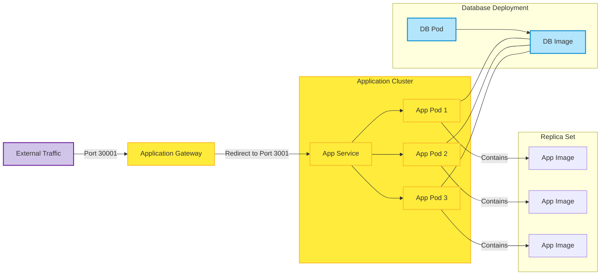

# Kubernetes

## Why is Kubernetes needed
Kubernetes is needed to manage containerised applications at scale. It automates deployment, scaling, and operations of application containers across clusters of hosts, helping developers and system administrators to manage complex microservices architectures.

## Benefits of Kubernetes
- **Scalability**: Automatically scale applications based on demand.
- **Resource Optimization**: Efficiently manage resources to improve performance and reduce costs.
- **High Availability**: Provides failover mechanisms to ensure service uptime.
- **Portability**: Runs on various cloud providers and on-premises infrastructure.
- **Self-Healing**: Automatically restarts containers that fail and replaces or reschedules them.
- **Declarative Configuration**: Manages configurations as code using manifests.
- **Open-Source**
- **Load-balancing**
- **Self-Healing**

## Success Stories
1. **Spotify**: Used Kubernetes to speed up development and improve infrastructure efficiency.
2. **Airbnb**: Improved service reliability and reduced operational complexity with Kubernetes.
3. **Pinterest**: Enhanced resource utilization and streamlined their infrastructure with Kubernetes.

## Kubernetes Architecture
Kubernetes architecture is based on a master-worker model. It includes multiple components that work together to maintain the desired state of applications.
- **Control plane (Master node)**: Manages the Kubernetes cluster, making scheduling decisions. It includes:
  - API Server: Main entry point of the cluster. 
  - etcd: A key-value store that stores all cluster data. 
  - Controller Manager: Monitors the cluster state and makes adjustments to meet the desired state. 
  - Scheduler: Assigns newly created pods to nodes based on resource availability, constraints and policies.
- **Worker nodes**: These nodes run the apps in pods:
  - Kubelet: The main agent on each worker node that receives instructions from the API server and manages pod lifecycle.
  - Kube-proxy: Manages network rules on each node to enable communication within and outside the cluster.
  - Container Runtime: The software (e.g., Docker, containerd) responsible for running containers.
- **Pods**: The smallest deployable units in Kubernetes, representing a single instance of a running process. Pods can contain one or more tightly coupled containers.
### Diagram

## The Cluster Setup
### What is a Cluster
A cluster in Kubernetes is a set of nodes (physical or virtual machines) used to run containerized applications. It consists of a **control plane** and one or more **worker nodes**.

### Master vs Worker Nodes
- **Master Node**: Manages the cluster, maintaining the desired state, scheduling workloads, and handling API requests.
- **Worker Node**: Runs containers and hosts application workloads. It has components like the kubelet, container runtime, and kube-proxy.

## Pros and Cons of Using Managed Service vs Launching Your Own
### Managed Service
- **Pros**: Simplifies management, automatic updates, high availability, and integrated security.
- **Cons**: Potentially higher cost and limited customisation.
### Self-Hosted
- **Pros**: Greater control, customisation, and possible cost savings.
- **Cons**: Requires expertise to manage, complex updates, and additional operational overhead.

## Control Plane vs Data Plane
- **Control Plane**: Manages the state of the cluster, making global decisions about scheduling and monitoring.
- **Data Plane**: Consists of worker nodes that run the actual workloads, executing the commands received from the control plane.

## Kubernetes Objects
Kubernetes uses several types of objects to manage applications, including:
- **Pods**: The smallest deployable unit, representing a single instance of a running process.
- **Deployments**: Manages stateless applications, handling updates and scaling.
- **ReplicaSets**: Ensures a specified number of pod replicas are running.
- **Services**: Defines a logical set of pods and a policy for accessing them.

## What Does it Mean a Pod is "Ephemeral"
Pods are considered ephemeral because they are temporary and can be created, destroyed, or replaced at any time, usually by automated processes like scaling events or node failures.

## How to Mitigate Security Concerns with Containers
- **Use Namespaces**: Isolate sensitive workloads using namespaces.
- **Resource Limits**: Set resource limits to prevent resource exhaustion attacks.
- **Pod Security Policies**: Enforce security standards on your pods.
- **Network Policies**: Control communication between pods and external traffic.
- Never run containers with root privileges
- **Monitoring and Logging**: Should be monitored closely and check container activity.

## Maintained Images
### What Are They?
Maintained images are container images provided by trusted sources or organizations that regularly update and patch vulnerabilities.

### Pros and Cons of Using Maintained Images for Your Base Container Images
- **Pros**: Regular updates, security patches, and trusted sources improve reliability. More documentation. Smaller images.
- **Cons**: Potential compatibility issues, larger image sizes, and dependency on external maintainers.

 

## General commands for Kubernetes
*  `kubectl get all`: this displays all the information (pods, services etc.)
*  `kubectl get deploy` (you can even specify `replicasets`, `pods`, `service`): this displays just the deploys currently.
*  `kubectl create -f <file-name>`: this will create/deploy. 
*  ` kubectl delete pod <pod-name>`: this will delete a specific pod (if you delete one Kubernetes will make another one).
*  `kubectl edit deploy nginx-deployment`: this will open a notepad editor and allow you to edit. You then save and exit the notepad once you have edited and it will save your changes. (`export KUBE_EDITOR=C:/Windows/notepad.exe` may need this if error message appears).
*  `kubectl scale --current-replicas=5 --replicas=6 deployment.apps/nginx-deployment`: this will change the number of replicas. 
*  `kubectl delete -f <file-name>`: this will delete the file (yaml).
  
## Deploy App
1. Create folder `k8s-app-yaml-definitions`
2. Create two files [app-deploy.yml](../k8s-app-yaml-definitions/app-deploy.yml) and [app-service.yml](../k8s-app-yaml-definitions/app-service.yml)
3. Run these Kubernetes commands: `kubectl create -f app-deploy.yml` and `kubectl create -f app-service.yml`. 
4. As we have used `port 30002`. Search `localhost:30002`. 

## Deploy App with DB
1. Create folder `k8s-app-db-yaml-definitions`
2. You can use the same scripts as above. 
3. You need to add environment variable to the [app-deploy.yml](../k8s-app-db-yaml-definitions/app-deploy.yml). 
4. Make [db-deploy.yml](../k8s-app-db-yaml-definitions/db-deploy.yml) and [db-service.yml](../k8s-app-db-yaml-definitions/db-service.yml)
5. Run these Kubernetes commands: `kubectl create -f db-deploy.yml` and `kubectl create -f db-service.yml`, `kubectl create -f app-deploy.yml`, and `kubectl create -f app-service.yml`. 

## Blockers
* In your `app-service.yml` when connecting with the database you need to change the `NodePort` and it can't be the same port as the `db-service.yml`.
* Make sure you create the `db-deploy.yml` and `db-service.yml` as the app needs something to connect to. 

